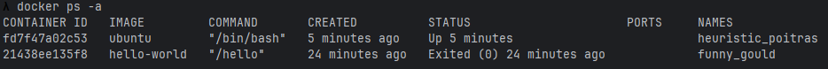
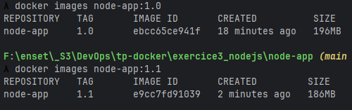

## TP1 : Docker & Docker Compose

Réalisé par: Oussama Khouya

### Exercice 1 - Découverte de Docker
1. Vérifiez que Docker Desktop est bien installé et démarré.


2. Exécutez votre premier conteneur avec l’image hello-world.!


3. Téléchargez l’image nginx:alpine sans la lancer.! 


4. Listez toutes les images présentes sur votre système.


5. Lancez un conteneur nginx en arrière-plan sur le port 8080. 


6. Vérifiez que le serveur web est accessible dans votre navigateur.


7. Affichez les logs du conteneur nginx.


8. Listez tous les conteneurs (en cours et arrêtés).


9. Arrêtez et supprimez le conteneur nginx.


10. Nettoyez les images inutilisées.


### Exercice 2 - Manipulation avancée des conteneurs

1. Lancez un conteneur Ubuntu en mode interactif.


2. Dans ce conteneur, installez curl et vim.


3. Créez un fichier test.txt avec du contenu.


4. Sortez du conteneur sans l’arrêter (Ctrl+P puis Ctrl+Q).
5. Copiez le fichier test.txt du conteneur vers votre machine.!

[img_19.png](snapshots/img_19.png)
6. Modifiez le fichier sur votre machine et recopiez-le dans le conteneur.


7. Reconnectez-vous au conteneur et vérifiez les modifications.


8. Créez une nouvelle image à partir de ce conteneur modifié.
```
docker commit heuristic_poitras heuristic_poitras2
```
9. Lancez un nouveau conteneur basé sur votre image personnalisée.


10. Testez que vos modifications sont bien présentes.


11. Bonus : Explorez les statistiques en temps réel des conteneurs!
```
docker stats
```

### Exercice 3 - Création d’une application web Node.js

1. Créez un dossier node-app pour votre projet.
````bash
mkdir node-app
cd node-app
touch package.json server.js Dockerfile .dockerignore
````
2. Créez les fichiers suivants :
   * package.json : Configuration npm avec Express 
   * server.js : Serveur web simple avec plusieurs routes 
   * Dockerfile : Instructions de containerisation 
   * .dockerignore : Exclusions pour l’image
````bash
touch package.json server.js Dockerfile .dockerignore
````
```
# Image de base
FROM node:18-alpine

# Répertoire de travail
WORKDIR /usr/src/app

# Copie package.json et installation des dépendances
COPY package.json ./
RUN npm install

# Copie du reste des fichiers
COPY . .

# Expose le port 3000
EXPOSE 3000

# Commande de lancement
CMD ["node", "server.js"]
```
```
{
  "name": "node-app",
  "version": "1.0.0",
  "main": "server.js",
  "dependencies": {
    "express": "^4.18.2"
  }
}
```
```
const express = require('express');
const app = express();

app.get('/', (req, res) => {
  res.send('Bienvenue sur la page d\'accueil !');
});

app.get('/api/health', (req, res) => {
  res.json({ status: 'OK' });
});

app.get('/api/info', (req, res) => {
  res.json({ environment: process.env.NODE_ENV || 'dev', nodeVersion: process.version });
});

app.get('/api/time', (req, res) => {
  res.json({ time: new Date().toISOString() });
});

const PORT = 3000;
app.listen(PORT, () => {
  console.log(`Serveur démarré sur le port ${PORT}`);
});
```
3. Construisez l’image Docker avec le tag node-app:1.0.
````bash
docker build -t node-app:1.0 .
````
4. Lancez le conteneur sur le port 3000.
````bash
docker run -d -p 3000:3000 --name node-app node-app:1.0
````
5. Testez toutes les routes de votre application.


6. Optimisez le Dockerfile pour réduire la taille de l’image.
```
FROM node:18-alpine AS build
WORKDIR /usr/src/app
COPY package.json ./
RUN npm install --production
COPY . .

FROM node:18-alpine
WORKDIR /usr/src/app
COPY --from=build /usr/src/app ./
EXPOSE 3000
CMD ["node", "server.js"]
```

7. Reconstruisez avec le tag node-app:1.1.
```
docker build -t node-app:1.1 .
```

8. Comparez les tailles des deux images.


9. Ajoutez un health check à votre Dockerfile.
````dockerfile
FROM node:18-alpine AS build
WORKDIR /usr/src/app
COPY package.json ./
RUN npm install --production
COPY . .

FROM node:18-alpine
WORKDIR /usr/src/app

# Install curl for healthcheck
RUN apk add --no-cache curl

COPY --from=build /usr/src/app ./

EXPOSE 3000

HEALTHCHECK --interval=30s --timeout=10s --start-period=5s CMD curl -f http://localhost:3000/api/health || exit 1

CMD ["node", "server.js"]

````
10. Testez le health check avec docker inspect.


### Exercice 4 - Stack complète avec Docker Compose
