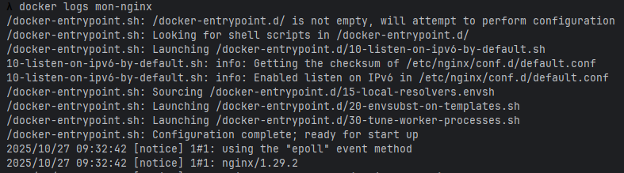

## TP1 : Docker & Docker Compose

Réalisé par: Oussama Khouya

### Exercice 1 - Découverte de Docker
1. Vérifiez que Docker Desktop est bien installé et démarré.
2. Exécutez votre premier conteneur avec l’image hello-world.
3. Téléchargez l’image nginx:alpine sans la lancer.! 
4. Listez toutes les images présentes sur votre système.
5. Lancez un conteneur nginx en arrière-plan sur le port 8080. 
6. Vérifiez que le serveur web est accessible dans votre navigateur.
7. Affichez les logs du conteneur nginx.
8. Listez tous les conteneurs (en cours et arrêtés).
9. Arrêtez et supprimez le conteneur nginx.
10. Nettoyez les images inutilisées.


### Exercice 2 - Manipulation avancée des conteneurs

1. Lancez un conteneur Ubuntu en mode interactif.
2. Dans ce conteneur, installez curl et vim.
3. Créez un fichier test.txt avec du contenu.
4. Sortez du conteneur sans l’arrêter (Ctrl+P puis Ctrl+Q).
5. Copiez le fichier test.txt du conteneur vers votre machine.
6. Modifiez le fichier sur votre machine et recopiez-le dans le conteneur. 
7. Reconnectez-vous au conteneur et vérifiez les modifications.
8. Créez une nouvelle image à partir de ce conteneur modifié.
```
docker commit heuristic_poitras heuristic_poitras2
```
9. Lancez un nouveau conteneur basé sur votre image personnalisée.!
10. Testez que vos modifications sont bien présentes.
11. Bonus : Explorez les statistiques en temps réel des conteneurs!
```
docker stats
```

### Exercice 3 - Création d’une application web Node.js
### Exercice 4 - Stack complète avec Docker Compose
